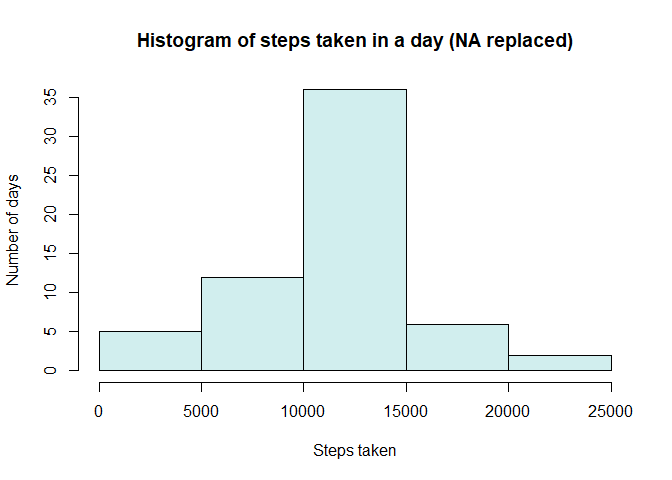

```r
  library(knitr)
  opts_chunk$set(fig.path = "./figures/") # corrected path and added dev
```

## Loading and preprocessing the data

```r
library(ggplot2)
library(chron)
```

```
## NOTE: The default cutoff when expanding a 2-digit year
## to a 4-digit year will change from 30 to 69 by Aug 2020
## (as for Date and POSIXct in base R.)
```

```r
unzip("activity.zip")
myData <- read.csv("activity.csv")
```

---

## What is mean total number of steps taken per day?

```r
byDay <- tapply(myData$step,myData$date,sum, na.rm=TRUE)

meanByDay <- mean(byDay)
medianByDay <- median(byDay)

hist(byDay, 
     main="Histogram of steps taken in a day", 
     xlab = "Steps taken", 
     ylab="Number of days", 
     col="pink",
     border="red",)
```

<!-- -->
  
### The mean is **9354.2295082** and the median is **10395**

---

## What is the average daily activity pattern?

```r
AvgByInt <- tapply(myData$step,as.factor(myData$interval),mean, na.rm=TRUE)
plot(names(AvgByInt), AvgByInt, 
     type="l",
     col="pink",
     lwd=3,
     main ="Average steps taken througout a day",
     xlab = "Time intervals",
     ylab = "Steps taken")
```

<!-- -->

```r
#Most steps
maxByInt <- AvgByInt[which.max(AvgByInt)]
```
  
### Most steps (206.1698113) taken in the 835. interval.

---

## Imputing missing values


```r
#Missing values
missSteps <- sum(is.na(myData$steps))

#Replace missing values with interval average
myData2 <- myData
for (i in 1:nrow(myData2)) {
        if (is.na(myData2[i,1])) {
                myData2[i,1] <- as.numeric(AvgByInt[names(AvgByInt)==myData2[i,3]])
        }
}
```

### There were **2304** missing values, which have been replaced by the interval averages.


```r
byDay2 <- tapply(myData2$step,myData2$date,sum, na.rm=TRUE)

#Mean and median
meanByDay2 <- mean(byDay2)
medianByDay2 <- median(byDay2)

#New histogram after missing values replaced
hist(byDay2, 
     main="Histogram of steps taken in a day (NA replaced)", 
     xlab = "Steps taken", 
     ylab="Number of days", 
     col="lightcyan2")
```

<!-- -->

### The mean now is **10766** and the median is **10766**

**Imputing missing data was making the distribution of steps taken daily more like a normal distribution.**

---

## Are there differences in activity patterns between weekdays and weekends?


```r
#Impute type of day
myData2$weekend <- is.weekend(as.Date(myData2$date))
myData2$weekend <- factor(as.numeric(myData2$weekend), labels=c("weekday", "weekend"), levels=c(0,1))

#Get averaged by factors
AvgByInt2 <- aggregate(steps ~ interval + weekend, myData2, mean)

ggplot(AvgByInt2, aes(interval,steps))+
        geom_line(col="blue")+
        facet_grid(weekend~.)
```

<!-- -->


